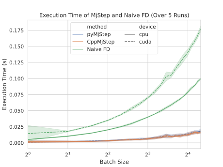
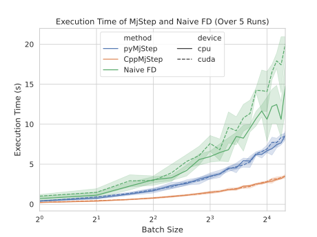

# CppMjStep: Extended Custom Autograd Function for Differentiable MuJoCo Dynamics

[](https://opensource.org/licenses/MIT)

## Description

An efficient integration between PyTorch and MuJoCo, implemented in C++. 
Enables automatic differentiation through MuJoCo simulation trajectories, 
allowing for gradient-based optimization of control policies directly within PyTorch. This implementation extends to sensors in the model, and uses C++ to improve on speed (although marginal).

---

## Features 

** pip Installable**: Simple installation through pip. Refer [INSTALL.md](./INSTALL.md).

** Efficient Gradient Computations**: Significantly more efficient than naive Jacobian finite differencing calculations as it utilizes the built-in finite difference method in MuJoCo [mjd_transitionFD](https://mujoco.readthedocs.io/en/stable/APIreference/APIfunctions.html#mjd-transitionfd).

** Multi-Step Calculations**: Provides the ability to estimate gradients over multiple simulation steps, by propagating gradients through the entire trajectory.

** Batch Simulation Support**: Enables batched simulations and gradient computations, significantly improving computational efficiency for large-scale experiments.

** Sensor Support**: Enables addition of sensors to the model, and allows backprop of sensor data through simulation with next to no cost to computation.

---
## Comparison of execution times

### Execution time for models with no sensors
<div style="text-align: center;">
    
</div>

### Execution time for models with no sensors (Python v/s C++)
<div style="text-align: center;">
    
</div>

### Execution time for models with sensors
<div style="text-align: center;">
    
</div>

### Execution time for models with no sensors (Python v/s C++)
<div style="text-align: center;">
    
</div>

---

## Usage

```python
import torch
import mujoco as mj
from CppMjStep import MjStep, PyMjStep

# Initialize MuJoCo model and data
xml_path = 'path/to/your/model.xml'
mj_model = mj.MjModel.from_xml_path(filename=xml_path)
mj_data = mj.MjData(mj_model)

# Define MjStep layer
torch_wrapped_model = MjStep(mj_model, mj_data, n_steps=5)

# Define initial state and control input tensors
state = torch.rand(mj_model.nq + 
                    mj_model.nv + 
                    mj_model.na + 
                    mj_model.nsensordata, 
                    requires_grad=True)
ctrl = torch.rand(mj_model.nu, requires_grad=True)

# Compute next state
next_state = MjStep(state, ctrl)
```

---

## Notes
- As of [MuJoCo 3.1.2](https://mujoco.readthedocs.io/en/3.1.2/changelog.html#python-bindings) the initial state passed to `rollout()` must include a time-step, such that `nstate = mj_stateSize(model, mjtState.mjSTATE_FULLPHYSICS)`. 
- Gradients are implicitly computed, to expose them refer [MjStep/nn_wrapper.py](MjStep/nn_wrapper.py)

---

## Citation

If you use this package in your research, a citation would be appreciated:

```
@software{CppMjStep2025,
  author = {Chariar, Mukundan},
  title = {{CppMjStep: Extended Custom Autograd Extension for Differentiable MuJoCo Dynamics}},
  year = {2025},
  version = {1.0},
  howpublished = {\url{https://github.com/mukundan-chariar1/CppMjStep}},
}
```

---

Special thanks to Elad Sharony, whose [DiffMjStep](https://github.com/EladSharony/DiffMjStep) inspired this module.
Portions of this code are derived from [DiffMjStep](https://github.com/EladSharony/DiffMjStep), which is MIT licensed.